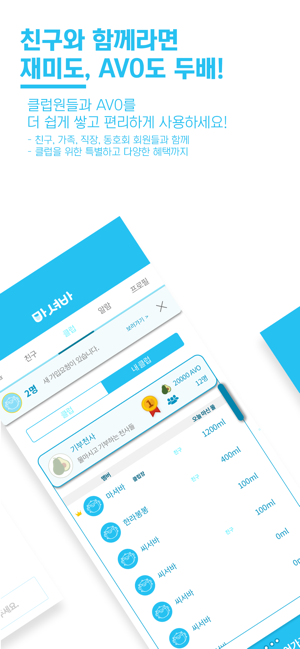

## 성경모 Sung Kyungmo
**iOS Developer : Objective-C, Swift**  
- Blog: https://kyungmosung.github.io
- Github: https://github.com/KyungmoSung
- Mail: <kmsung0617@gmail.com>

 
 
## 경력사항

### 오픈잇
- 기간 : 2018.03 ~ 현재
- 직급 : 대리

### 이스트블루
- 기간 : 2017.04 ~ 2018.02
- 직급 : 사원

 

## 프로젝트

### SHP
- 소개 : 호텔신라 식사코칭, 운동코칭, 헬스케어 앱
- 소속 : 오픈잇
- 기간 : 2018.03 ~ 현재
- 역할 : iOS 개발 및 서비스
- 사용기술 : Objective-C, Swift, SnapKit, Alamofire, Coredata, Firebase
- 앱스토어 : https://apps.apple.com/kr/app/shp/id1073101936

 

### 마셔바
- 소개 : 물 마시기 습관, 광고형 리워드 앱
- 소속 : 이스트블루
- 기간 : 2017.09 ~ 2018.02
- 역할 : iOS 개발 및 서비스
- 사용기술 : Swift, Alamofire, Realm, SnapKit, Firebase
- 앱스토어 : https://apps.apple.com/kr/app/id1441977200

   

### 씨서바
- 소개 : 위치기반 찜질방 검색 및 할인 앱
- 소속 : 이스트블루
- 기간 : 2017.04 ~ 2018.02
- 역할 : iOS, Android 개발 및 서비스
- 사용기술 : Swift, Java, Alamofire, Hero, Daum maps, Crashlytics
- 앱스토어 : https://apps.apple.com/kr/app/id1242743211

   

### 서피비치
- 소개 : 서핑장 서피비치 소개, 예약 웹앱
- 소속 : 이스트블루
- 기간 : 2017.06 ~ 2017.09
- 역할 : iOS 개발 및 서비스
- 사용기술 : Swift, SnapKit
- 앱스토어 : https://apps.apple.com/kr/app/id1238635375

   
